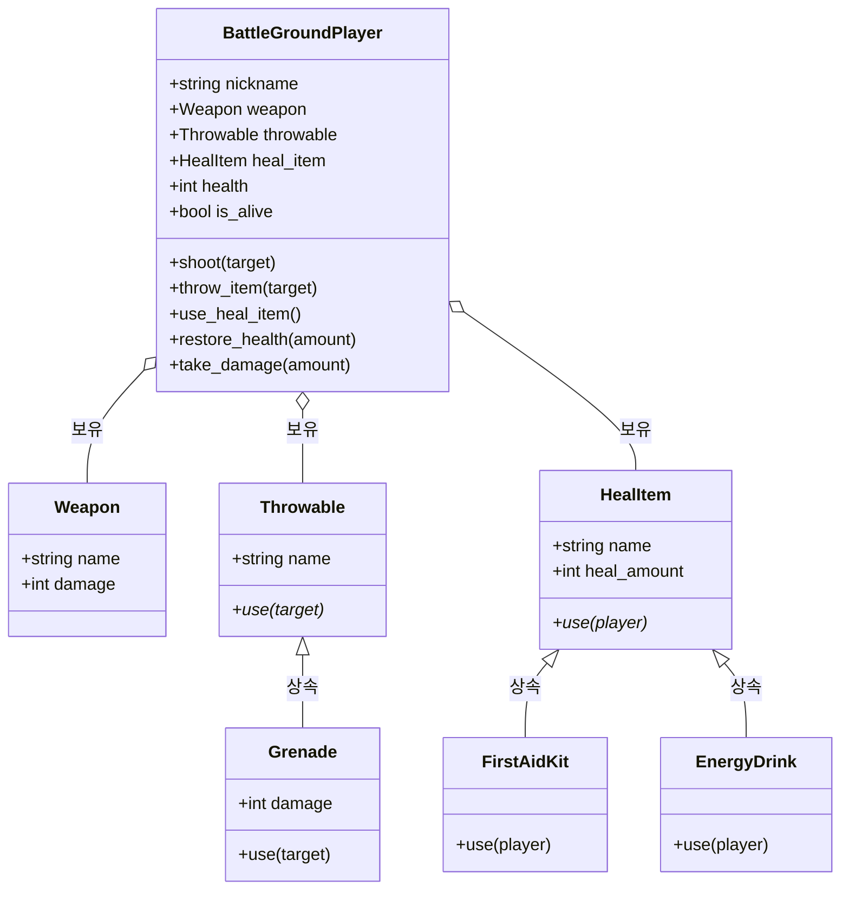

# [Python] 배틀그라운드 게임을 모티브로 한 클래스 상속 및 상호작용 구현하기

안녕하세요! 오늘은 파이썬의 **객체지향 프로그래밍(OOP)** 핵심 개념인 **상속(Inheritance)**, **다형성(Polymorphism)**, 그리고 **객체 간 상호작용**을 게임 스크립트 형태로 재미있게 풀어보는 실습을 진행했습니다.

---

## 📐 1. 클래스 다이어그램 (Mermaid)

각 클래스의 상속 관계와 주요 속성/메서드 구조를 시각화한 클래스 다이어그램입니다.



---

## 💻 2. 전체 소스 코드

> ```python
> # 1. 총기 클래스
> class Weapon:
>     def __init__(self, name):
>         self.name = name
>         weapon_stats = {"SKS": 75, "SCAR-L": 42, "AWM": 100, "권총": 25}
>         self.damage = weapon_stats.get(name, 20)
> 
> 
> # 2. 투척류 클래스들 (기존)
> class Throwable:
>     def __init__(self, name):
>         self.name = name
> 
>     def use(self, target):
>         pass
> 
> 
> class Grenade(Throwable):
>     def __init__(self):
>         super().__init__("수류탄")
>         self.damage = 80
> 
>     def use(self, target):
>         print(f"💥 핀을 뽑고 수류탄을 던졌습니다! 쾅! (데미지: {self.damage})")
>         target.take_damage(self.damage)
> 
> 
> # 3. 🆕 회복 아이템 부모 클래스
> class HealItem:
>     def __init__(self, name, heal_amount):
>         self.name = name
>         self.heal_amount = heal_amount  # 회복량
> 
>     def use(self, player):
>         """자식 클래스에서 재정의할 회복 함수"""
>         pass
> 
> 
> # 4. 🆕 구급상자 클래스 (HealItem 상속)
> class FirstAidKit(HealItem):
>     def __init__(self):
>         super().__init__("구급상자", 75)  # 이름과 회복량(75) 전달
> 
>     def use(self, player):
>         print(f"🩹 [{player.nickname}]이(가) 구급상자를 사용하여 상처를 붕대로 감습니다... (체력 +{self.heal_amount})")
>         player.restore_health(self.heal_amount)
> 
> 
> # 5. 🆕 에너지 음료 클래스 (HealItem 상속)
> class EnergyDrink(HealItem):
>     def __init__(self):
>         super().__init__("에너지 음료", 25)  # 이름과 회복량(25) 전달
> 
>     def use(self, player):
>         print(f" energética 캔을 따서 마십니다! 🥤 [{player.nickname}] (체력 +{self.heal_amount})")
>         player.restore_health(self.heal_amount)
> 
> 
> # 6. 플레이어 클래스 (회복 아이템 기능 추가)
> class BattleGroundPlayer:
>     def __init__(self, nickname, weapon, throwable=None, heal_item=None):
>         self.nickname = nickname
>         self.weapon = weapon
>         self.throwable = throwable
>         self.heal_item = heal_item  # 🔗 회복 아이템 장착 슬롯 추가
>         self.health = 100
>         self.is_alive = True
> 
>     def shoot(self, target):
>         if not self.is_alive or not target.is_alive:
>             return
>         print(f"[{self.nickname}]이(가) [{target.nickname}]에게 {self.weapon.name} 사격! 🎯")
>         target.take_damage(self.weapon.damage)
> 
>     def throw_item(self, target):
>         if not self.is_alive or self.throwable is None:
>             return
>         print(f"[{self.nickname}]이(가) [{target.nickname}]쪽으로 {self.throwable.name} 투척!")
>         self.throwable.use(target)
> 
>     def use_heal_item(self):
>         """회복 아이템을 사용하는 함수"""
>         if not self.is_alive:
>             print(f"[{self.nickname}]은(는) 기절하여 회복할 수 없습니다.")
>             return
> 
>         if self.heal_item is None:
>             print(f"[{self.nickname}]은(는) 가진 회복 아이템이 없습니다!")
>             return
> 
>         print(f"[{self.nickname}]이(가) 가방에서 회복 아이템을 꺼냅니다.")
>         self.heal_item.use(self)  # 🔗 내 자신(self)을 전달해서 내 체력을 채우게 함!
> 
>     def restore_health(self, amount):
>         """체력을 회복하는 함수"""
>         self.health += amount
>         if self.health > 100:
>             self.health = 100  # 체력은 최대 100까지만 회복 가능
>         print(f"✨ [{self.nickname}] 체력 회복 완료! 현재 체력: {self.health}")
> 
>     def take_damage(self, amount):
>         self.health -= amount
>         if self.health <= 0:
>             self.health = 0
>             self.is_alive = False
>             print(f"💀 [{self.nickname}]이(가) 치명상을 입고 로비로 사출되었습니다.")
>         else:
>             print(f"🛡️ [{self.nickname}] 남은 체력: {self.health}")
> 
> 
> # --- 객체 생성 및 테스트 ---
> 
> kit = FirstAidKit()  # 구급상자 객체 생성 (회복량 75)
> Drink = EnergyDrink()
> grenade = Grenade()
> 
> # 플레이어가 무기와 구급상자를 가지고 시작
> player1 = BattleGroundPlayer(nickname=input('닉네임 설정: '), weapon=Weapon(input("총 선택 (SKS, SCAR-L, AWM, 권총): ")), heal_item=kit)
> player2 = BattleGroundPlayer(nickname=input('닉네임 설정: '), weapon=Weapon(input("총 선택 (SKS, SCAR-L, AWM, 권총): ")), heal_item=kit)
> 
> player1.shoot(player2)
> player2.throw_item(player1)
> player1.use_heal_item()
> player2.use_heal_item()
> player2.shoot(player1)
> player1.shoot(player2)
> ```

---

## 💡 3. 핵심 설계 포인트

1. **상속(Inheritance)의 활용**:
   * `Throwable`과 `HealItem` 부모 클래스를 정의하여 공통 속성(`name`, `heal_amount`) 및 메서드 명세를 구현했습니다.
   * `Grenade`, `FirstAidKit`, `EnergyDrink` 자식 클래스가 이를 상속받아 개별 특성에 맞춰 오버라이딩(재정의)했습니다.
2. **의존성 주입과 `self` 객체 전달**:
   * `use_heal_item()` 메서드 내부에서 `self.heal_item.use(self)` 호출을 통해, 아이템 객체에게 '나 자신(`self`)'을 매개변수로 전달하여 플레이어의 체력을 올리도록 연결했습니다.
3. **상태값 기반 안전성 관리**:
   * `self.is_alive` 변수를 이용해 이미 사망한 플레이어는 사격, 투척, 회복 등의 행동을 하지 못하도록 예외처리가 깔끔하게 작성되어 있습니다.
